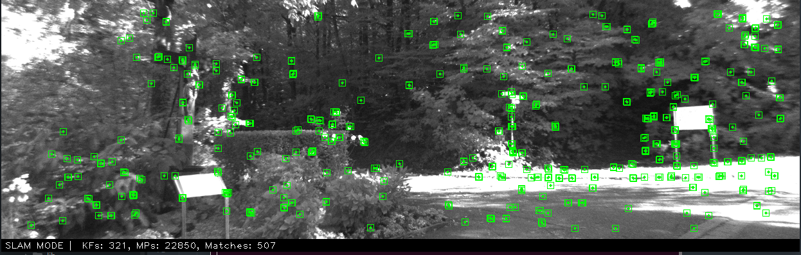
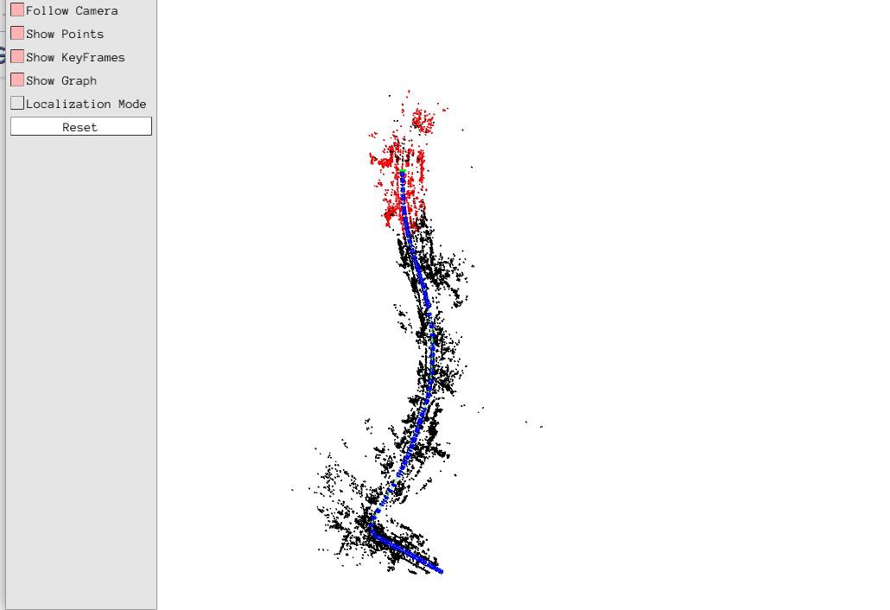

# SuperPoint-SLAM

**UPDATE: Add citation**

This repository was forked from ORB-SLAM2 https://github.com/raulmur/ORB_SLAM2.  SuperPoint-SLAM is a modified version of ORB-SLAM2 which use SuperPoint as its feature detector and descriptor. The pre-trained model of SuperPoint  come from https://github.com/MagicLeapResearch/SuperPointPretrainedNetwork.

**NOTE: SuperPoint-SLAM is not guaranteed to outperform ORB-SLAM. It's just a trial combination of SuperPoint and ORB-SLAM. I release the code for people who wish to do some research about neural feature based SLAM.**






### Related Publications:

Deng, C., Qiu, K., Xiong, R., & Zhou, C. (2019, July). **Comparative Study of Deep Learning Based Features in SLAM.** In 2019 4th Asia-Pacific Conference on Intelligent Robot Systems (ACIRS) (pp. 250-254). IEEE.

## 1. License (inherited from ORB-SLAM2)

See LICENSE file.

## 2. Prerequisites
We have tested the library in **Ubuntu 12.04**, **14.04** and **16.04**, but it should be easy to compile in other platforms. A powerful computer (e.g. i7) will ensure real-time performance and provide more stable and accurate results.

### C++11 or C++0x Compiler
We use the new thread and chrono functionalities of C++11.

### Pangolin
We use [Pangolin](https://github.com/stevenlovegrove/Pangolin) for visualization and user interface. Dowload and install instructions can be found at: https://github.com/stevenlovegrove/Pangolin.

### OpenCV
We use [OpenCV](http://opencv.org) to manipulate images and features. Dowload and install instructions can be found at: http://opencv.org. **Required at leat 2.4.3. Tested with OpenCV 2.4.11 and OpenCV 3.2**.

### Eigen3
Required by g2o (see below). Download and install instructions can be found at: http://eigen.tuxfamily.org. **Required at least 3.1.0**.

### DBoW3 and g2o (Included in Thirdparty folder)
We use modified versions of [DBoW3](https://github.com/rmsalinas/DBow3) (instead of DBoW2) library to perform place recognition and [g2o](https://github.com/RainerKuemmerle/g2o) library to perform non-linear optimizations. Both modified libraries (which are BSD) are included in the *Thirdparty* folder.

### Libtorch

We use Pytorch C++ API to implement SuperPoint model. It can be built as follows:

``` shell
git clone --recursive -b v1.0.1 https://github.com/pytorch/pytorch
cd pytorch && mkdir build && cd build
python ../tools/build_libtorch.py
```

It may take quite a long time to download and build. Please wait with patience.

**NOTE**: Do not use the pre-built package in the official website, it would cause some errors.

## 3. Building SuperPoint-SLAM library and examples

Clone the repository:
```
git clone https://github.com/KinglittleQ/SuperPoint_SLAM.git SuperPoint_SLAM
```

We provide a script `build.sh` to build the *Thirdparty* libraries and *SuperPoint_SLAM*. Please make sure you have **installed all required dependencies** (see section 2). Execute:
```
cd SuperPoint_SLAM
chmod +x build.sh
./build.sh
```

This will create **libSuerPoint_SLAM.so**  at *lib* folder and the executables **mono_tum**, **mono_kitti**, **mono_euroc** in *Examples* folder.

**TIPS:**

If cmake cannot find some package such as OpenCV or EIgen3, try to set XX_DIR which contain XXConfig.cmake manually. Add the following statement into `CMakeLists.txt`  before `find_package(XX)`:

``` cmake
set(XX_DIR "your_path")
# set(OpenCV_DIR "usr/share/OpenCV")
# set(Eigen3_DIR "usr/share/Eigen3")
```

## 4. Download Vocabulary

You can download the vocabulary from [google drive](https://drive.google.com/file/d/1p1QEXTDYsbpid5ELp3IApQ8PGgm_vguC/view?usp=sharing) or [BaiduYun](https://pan.baidu.com/s/1fygQil78GpoPm0zoi6BMng) (code: de3g). And then put it into `Vocabulary` directory. The vocabulary was trained on [Bovisa_2008-09-01](http://www.rawseeds.org/rs/datasets/view//7) using DBoW3 library. Branching factor k and depth levels L are set to 5 and 10 respectively.

## 5. Monocular Examples

### KITTI Dataset  

1. Download the dataset (grayscale images) from http://www.cvlibs.net/datasets/kitti/eval_odometry.php 

2. Execute the following command. Change `KITTIX.yaml`by KITTI00-02.yaml, KITTI03.yaml or KITTI04-12.yaml for sequence 0 to 2, 3, and 4 to 12 respectively. Change `PATH_TO_DATASET_FOLDER` to the uncompressed dataset folder. Change `SEQUENCE_NUMBER` to 00, 01, 02,.., 11. 
```
./Examples/Monocular/mono_kitti Vocabulary/ORBvoc.txt Examples/Monocular/KITTIX.yaml PATH_TO_DATASET_FOLDER/dataset/sequences/SEQUENCE_NUMBER
```

## 6. Evaluation Results on KITTI

Here are the evaluation results of monocular benchmark on KITTI using RMSE(m) as metric.

| Seq. |  Dimension  |    ORB    | SuperPoint |
| :--: | :---------: | :-------: | :--------: |
|  00  |  564 x 496  | **5.33**  |     X      |
|  01  | 1157 × 1827 |     X     |     X      |
|  02  |  599 × 946  | **21.28** |     X      |
|  03  |  471 × 199  |   1.51    |  **1.04**  |
|  04  |  0.5 × 394  |   1.62    |  **0.35**  |
|  05  |  479 × 426  |   4.85    |  **3.73**  |
|  06  |  23 × 457   | **12.34** |   14.27    |
|  07  |  191 × 209  | **2.26**  |    3.02    |
|  08  |  808 × 391  |   46.68   | **39.63**  |
|  09  |  465 × 568  | **6.62**  |     X      |
|  10  |  671 × 177  |   8.80    |  **5.31**  |

## Citation

If you find this useful, please cite our paper.
```
@inproceedings{deng2019comparative,
  title={Comparative Study of Deep Learning Based Features in SLAM},
  author={Deng, Chengqi and Qiu, Kaitao and Xiong, Rong and Zhou, Chunlin},
  booktitle={2019 4th Asia-Pacific Conference on Intelligent Robot Systems (ACIRS)},
  pages={250--254},
  year={2019},
  organization={IEEE}
}
```

